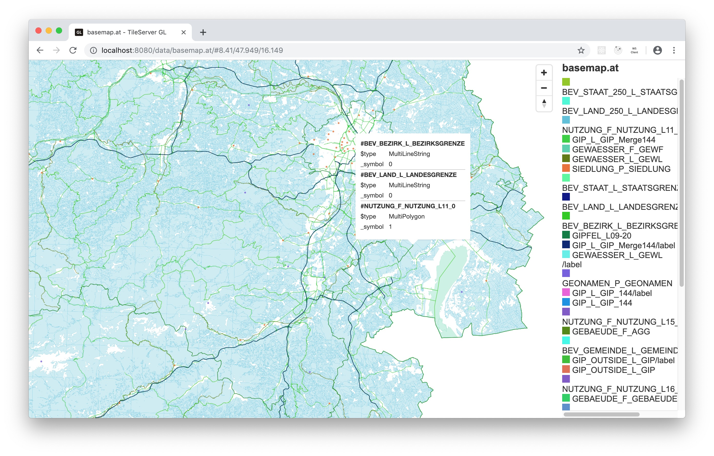

# OpenVTPK

ESRI's Vector Tile Package (VTPK) archive contains vector tiles that follow Mapbox' Vector Tile specification v2.0. In addition all resources to render the tiles are include (i.e. stylesheet, fonts, etc.).

Unfortunately none of the open source vector tile servers are able to process VTPK packages. Most require either an MBTiles container or an GeoPackage.

The aim of OpenVTPK is to extract the tiles from a VTPK and to re-package them in a container that is supported by open source tile servers.

In the first run repackaging from VTPK to MBTiles is supported.

## Motivation

Austria's government publishes detailed geospatial data like tiles, elevation data etc. at [data.gv.at](https://www.data.gv.at/?s=basemap.at). One can find vector tiles for the [region of Austria](https://www.data.gv.at/katalog/dataset/a73befc7-575f-48cb-8eb9-b05172a8c9e3) in order to use them offline. The publishing format ist VTPK.

## What to expect

OpenVTPK is a _proof of concept_ to repackage vector tiles into a MBTiles container. This software is __not production ready__. Instead it should be treated as a common ground to start discussion about the usage of open data with open (source) software.

Some of the information provided in the source code is hard coded to _basemap.at_. If you want to use the code otherwise you need to change these values accordingly.

## What to do before running openvtpk

VTPK packages are zipped archives. One can unzip them by using your favorite software like 7z.

OpenVTPK expects the VTPK package to be unzipped into a folder of your choice. Please change the folder name in the source code to meet your target.

## What you get

Running ```node ./index.js``` will
* create a MBTiles container named ```basemap.at.mbtiles```
* extract the vector tiles from the VTPK folder
* read the first tile per zoom level in order to extract the layer names
* write the tiles to the MBTiles container
* write metadata (including the layer names extracted previously) to the MBTiles container

Running OpenVTPK will take a view minutes an the resulting  ```basemap.at.mbtiles``` will have a size of 2.7 GByte.

## How to view the tiles

Please use your favorite tile server to view the basemap.at tiles offline. 

### nodejs server
An easy-to-use option may be [@mapbox/mbview](https://github.com/mapbox/mbview). Just clone the repository and start the tile server

```javascript
node ./cli.js PATH_TO_YOUR/basemap.at.mbtiles
```

Open your browser and be a little patient:


### Docker container klokantech/tileserver-gl
If you prefer using a docker container _tileserver-gl_ can be a good start. Run the following command to start the container within the folder where you stored the mbtiles file:

```bash
docker run --rm -it -v $(pwd):/data -p 8080:80 klokantech/tileserver-gl
```

Open your browser and visit ```http://localhost:8080```:



### Styling the basemap

The provided VTPK container also includes a style file. The current way OpenVTPK extracts the layer names does not fully match the ones used in the style file.

After some modifications I was able to apply the style provided by _basemap.at_ using _tileserver-gl_:


