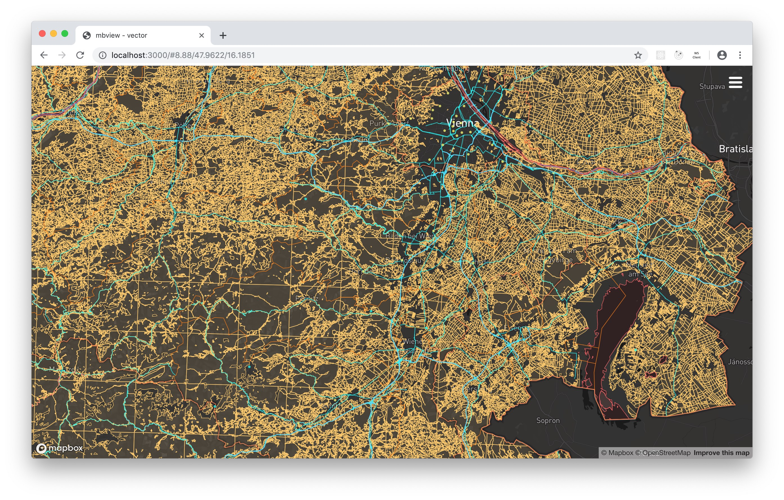
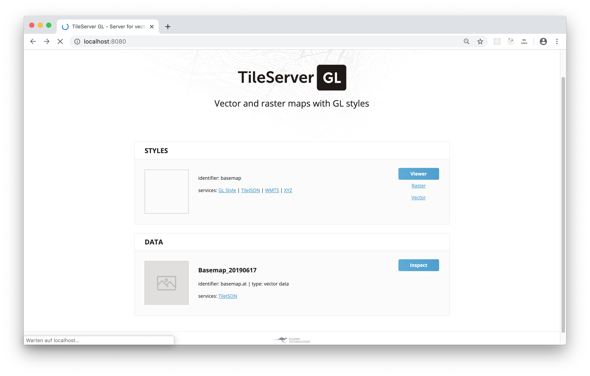
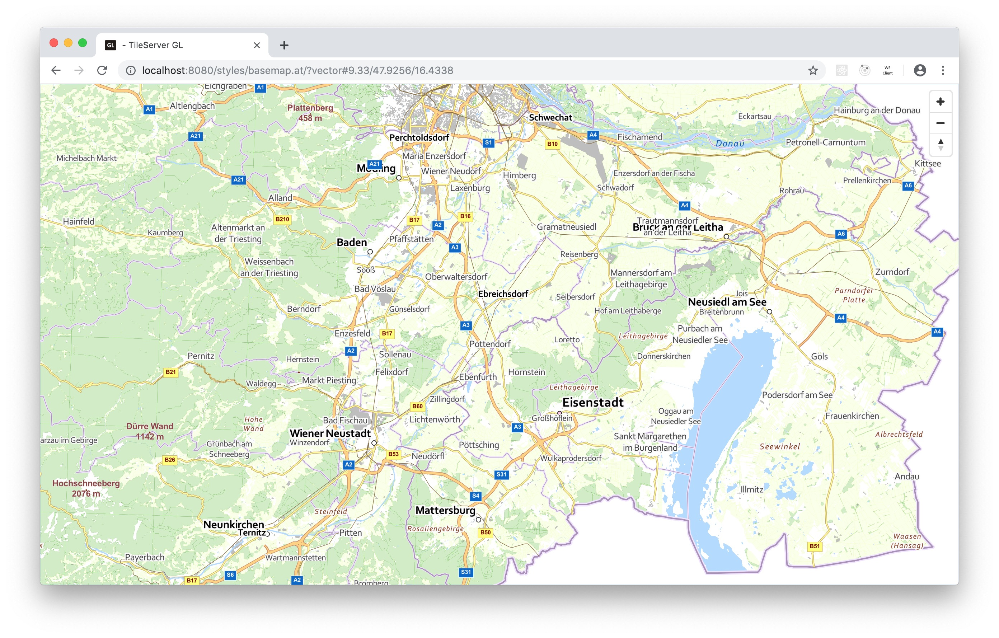

# OpenVTPK

ESRI's Vector Tile Package (VTPK) archive contains vector tiles that follow Mapbox' Vector Tile specification v2.0. In addition all resources to render the tiles are included (i.e. stylesheet, fonts, etc.).

Unfortunately none of the open source vector tile servers is able to process VTPK packages. Most require either an MBTiles container or a GeoPackage.

The aim of OpenVTPK is to extract the tiles from a VTPK and to re-package them into a container that is supported by open source tile servers.

In the first run repackaging from VTPK to MBTiles is supported.

## Motivation

Austria's government publishes detailed geospatial data like vector and raster tiles, elevation data etc. at [data.gv.at](https://www.data.gv.at/?s=basemap.at). One can find vector tiles for the [region of Austria](https://www.data.gv.at/katalog/dataset/a73befc7-575f-48cb-8eb9-b05172a8c9e3) in order to use them offline. The publishing format ist VTPK.

## What to do before running OpenVTPK

VTPK packages are zipped archives. You can unzip them by using your favorite software like 7z.

OpenVTPK expects the VTPK package to be unzipped into a folder of your choice. Later on this folder will be referred to as _SOURCEFOLDER_.

## Installation

```shell
  git clone https://github.com/syncpoint/openvtpk.git
  npm install
```

OpenVTPK ist using Heroku's [Open CLI FRamework (OCLIF)](https://github.com/oclif/oclif) in order to provide a professional user experience. After installing OpenVTPK you may run ```bin/run``` to get information about the commands available.

## Running a transformation

If your expanded VTPK container is located in _SOURCEFOLDER_ run the following in order to repackage the tiles to an MBTiles container. You may limit the zoom levels by providing the optional ```-l=minZoomLevel...maxZoomLevel``` parameter.

```shell
  bin/run transform SOURCEFOLDER [-l=min..max]
```

I.e. to process the levels 7 to 11 use ```-l=7..11```.
If you use ```-l=..6``` the levels 0 to 6 wil be processed.

By setting the flag to ```-l=14..``` all levels from (including) 14 up to
the maximum level available will be processed.

The default value for this flag is ```-l=0..```.

### What you get

OpenVTPK will 

* create an MBTiles container named after the data in the ```root.json``` file
* extract the vector tiles from the VTPK folder
* extract the layer names
* write the tiles to the MBTiles container
* write metadata (including the layer names extracted previously) to the MBTiles container

Depending on the size of your VTPK and the levels to extract running OpenVTPK will take a few minutes.

If you run OpenVTPK multiple times please make sure to remove the existing MBtiles file.

## How to view the tiles

Please use your favorite tile server to view the basemap.at tiles offline. 

### @mapbox/mbview
An easy-to-use option may be [@mapbox/mbview](https://github.com/mapbox/mbview). Just clone the repository and start the tile server

```javascript
node ./cli.js PATH_TO_YOUR/basemap.at.mbtiles
```

Open your browser and be a little patient:



### klokantech/tileserver-gl (Docker)
If you prefer using a docker container _tileserver-gl_ can be a good start. Run the following command to start the container within the folder where you stored the mbtiles file:

```bash
docker run --rm -it -v $(pwd):/data -p 8080:80 klokantech/tileserver-gl
```

Open your browser and visit ```http://localhost:8080```:


## Styling

The provided VTPK container also includes all resources required to style the vector tiles:
* fonts
* sprites
* styles 

The _styles_ folder should contain a _JSON_ file that containes styling rules. These rules must follow the [Mapbox GL Style Specification](https://docs.mapbox.com/mapbox-gl-js/style-spec/).


## Local _basemap.at_ vector tiles with styles applied

In order to use the repackaged vector tiles with the styles applied we will use the VTPK package from Austria's [basemap.at Verwaltungsgrundkarte Vektor Offline Österreich](https://www.data.gv.at/katalog/dataset/b694010f-992a-4d8e-b4ab-b20d0f037ff0). 
We will use Klokan Technologies [TileServer GL](https://tileserver.readthedocs.io/en/latest/) to serve the tiles and the corresponding styles. Since Docker is our best friend there is no need for a complicated setup procedure.

All the resources required are located in the ```p12/resources``` subfolder of your expanded VTPK container (see description above).

Let's create a folder that will become the root folder for _TileServer GL_ (i.e. ```basemap```) and copy the folders ```fonts```, ```styles``` and ```sprites``` from the ```p12/resources``` folder. We do not need the ```infos``` folder. 

Create an additional ```tiles``` folder and put the _mbtiles_ file you want to serve here. Please follow the instructions above in order to repackage the _basemap.at_ VTPK container which we will use in this example.

After that your folder structure should look like this:

```
basemap
  fonts
    Arial Regular
    Arial Bold
    Corbel Regular
    Corbel Bold
    Corbel Italic
    Corbel Bold Italic
    Tahoma Regular
  sprites
    sprite.png
      sprite.json
      sprite@2x.png
      sprite@2x.json
  styles
    root.json
  tiles
    Basemap_20190617.mbtiles
```

Now we are ready to create a configuration file (_config.js_) for _TileServer GL_:

```JSON
{
  "options": {
    "paths": {
      "root": "",
      "fonts": "fonts",
      "sprites": "sprites",
      "styles": "styles",
      "mbtiles": "tiles"
    }
  },
  "styles": {
    "basemap": {
      "style": "root.json",
      "serve_data": true
    }
  },
  "data": {
    "basemap.at": {
      "mbtiles": "Basemap_20190617.mbtiles"
    }
  },
  "settings": {
    "serve": {
      "vector": true,
      "raster": true,
      "services": true,
      "static": true
    },
    "raster": {
      "format": "PNG_256",
      "hidpi": 2,
      "maxsize": 2048
    }
  }
}
```
The settings are pretty straight-forward and reflect the folder structure and the files we already used.
Since the style file ```root.json``` contains path references that are relative to the internal VTPK folder structure we have to edit this file. Open the file and change the values for ```sprite```, ```glyphs``` and ```url``` accordingly. Since we configured _TileServer GL_ to use path prefix' the path must be _relative_ to the associated folders. When you're done your style should contain values as follow:

```JSON
    "sprite": "/sprite",
    "glyphs": "/{fontstack}/{range}.pbf",
    "sources": {
        "esri": {
            "type": "vector",
            "url": "/data/basemap.at.json"
        }
    }
```

Open your console, change to the _basemap_ folder we created and start _TileServer GL:_

```bash
docker run --rm -it -v $(pwd):/data -p 8080:80 klokantech/tileserver-gl
Starting Xvfb on display 99
xdpyinfo:  unable to open display ":99".
xdpyinfo:  unable to open display ":99".

Starting tileserver-gl v2.6.0
Using specified config file from config.json
Starting server
Listening at http://[::]:80/
Startup complete
```

Open your favorite browser and navigate to __http://localhost:8080__ (we have mapped TCP port 80 from within the docker container to port 8080 on our local machine):



Click on the __Vector__ link on the dashboard in order to view your styled vector tiles. Depending on the correctness of the metadata in the VTPK file and the style rules (especially ```minzoom``` and ```maxzoom```) your viewpoint my be out of scope and you will only see a white page. Please change the zoom level and the coordinates in the browser url accordingly.

The result is beautiful and available offline:


